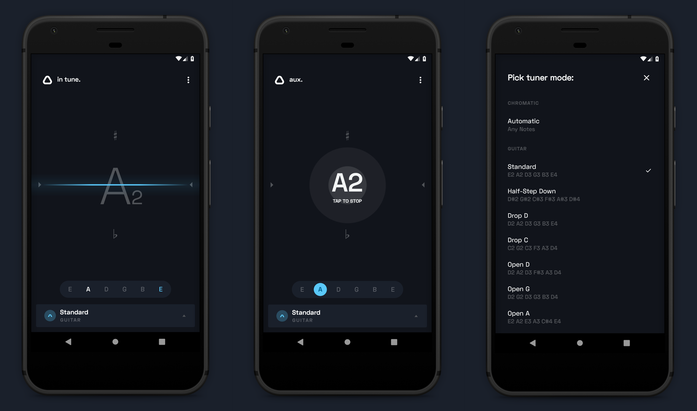

# Auxilium

Auxilium is chromatic instrument tuner application for Android, designed to bring you the simplest tuning experience possible.

Features:
* Minimalistic interface
* Chromatic mode
* Premade tuner modes for guitars, fiddle instruments and more...
* English and Solfege notations
* Sharp (♯ / Di) & Flat (♭ / Ra) accidental naming
* Note audio samples available

## Contributing
The pitch detection part of this application is based on the [aubio](https://github.com/aubio/aubio) library.
All contributions are welcome, though the highest priority in order would be:
* **Better implementation of the library.** Audio processing isn't my strong side, but the current implementation seems very lacking.
* **Better note audio samples.** Current ones have lots of distortion and clipping in them.
* **Any best practice Android Development points I missed.**

## Screenshots

